# 子域名收集
https://www.freebuf.com/articles/web/215182.html

## DNS数据集平台
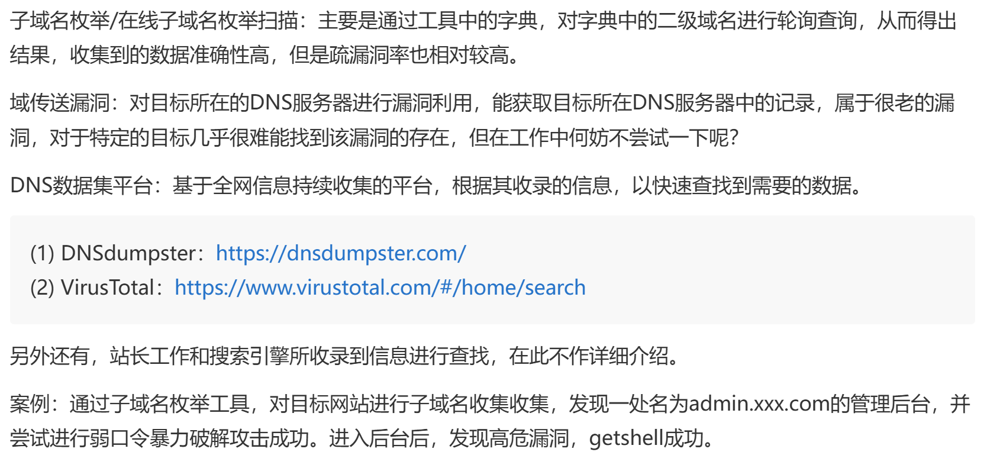
### DNSdumpster(https://dnsdumpster.com/ )
### VirusTotal(https://www.virustotal.com/#/home/search )

## 防火墙(waf)识别
### 原理:主要是通过请求中的状态码返回的响应头容、正文内容，进行匹配和判断的
### 做渗透测试的时候，如果遇到防火墙的话，就通过不断地尝试去绕过他的防火墙规则(黑名单)，或者通过某些方法获得防火墙的源码，去审计规则从而进行绕过；或者根据以前的绕过经验对目标防火墙进行绕过，这个绕过工作需要要足够的时间和耐心才能够完成

## 端口服务收集
### Nmap
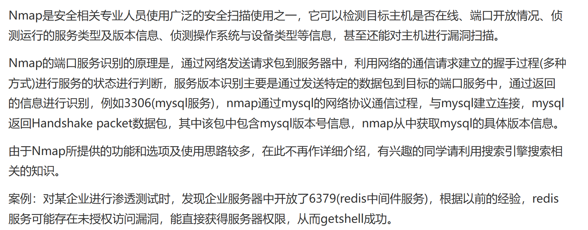

## C段IP信息收集
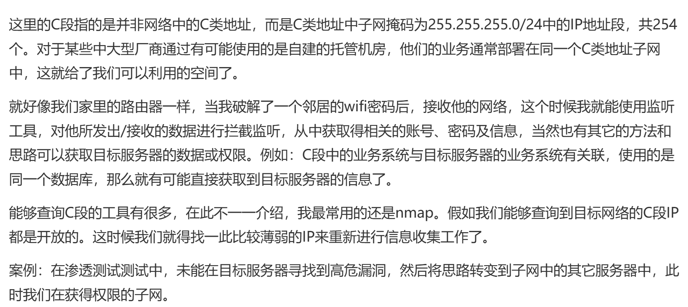
### ettercap

## 旁站信息收集
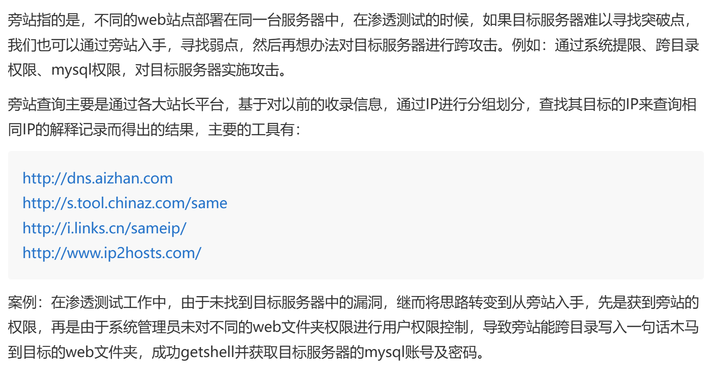

## 敏感目录/文件收集
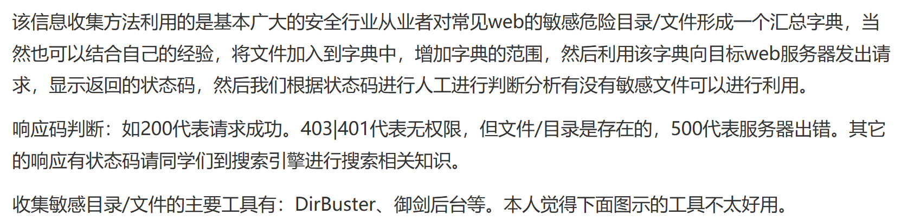

## IIS短文件名枚举
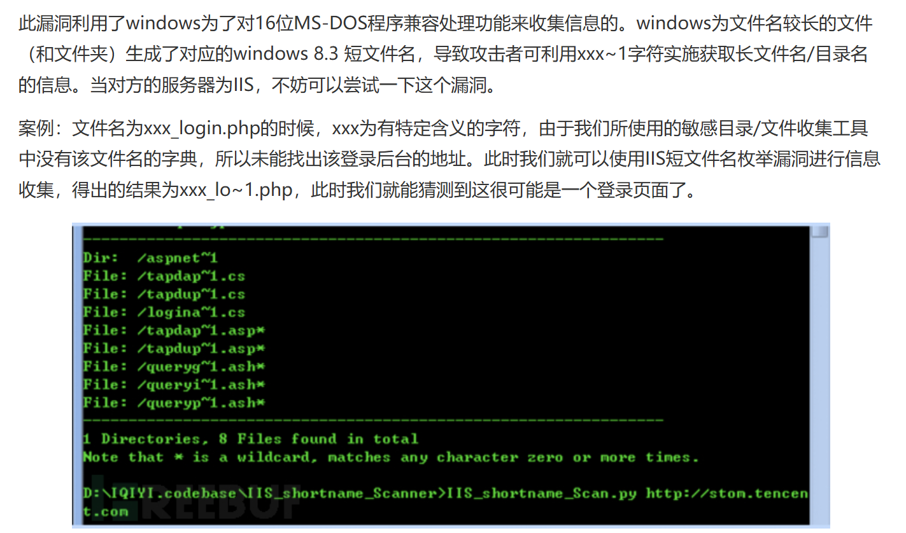

## Github信息收集

## 网站资产信息探测
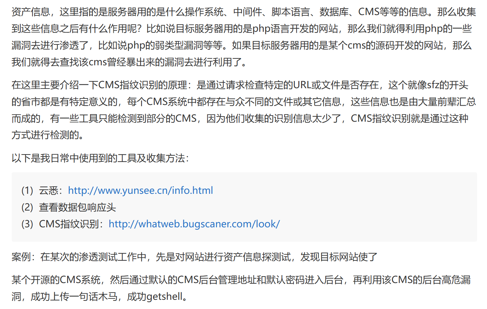
### 云悉(https://www.yunsee.cn/)
### CMS指纹识别(http://whatweb.bugscaner.com/look/ )
### 查看数据包响应头

## shodan、fofa、钟馗之眼信息收集
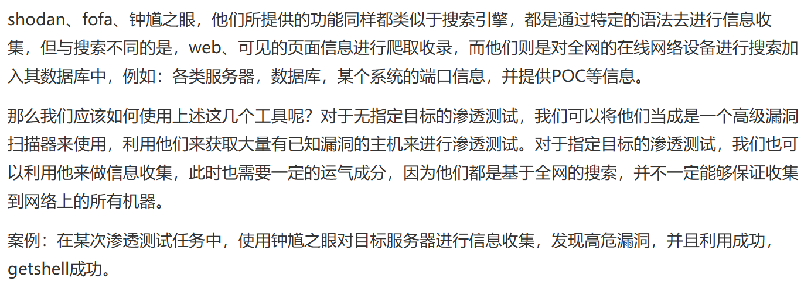

## 寻找真实IP
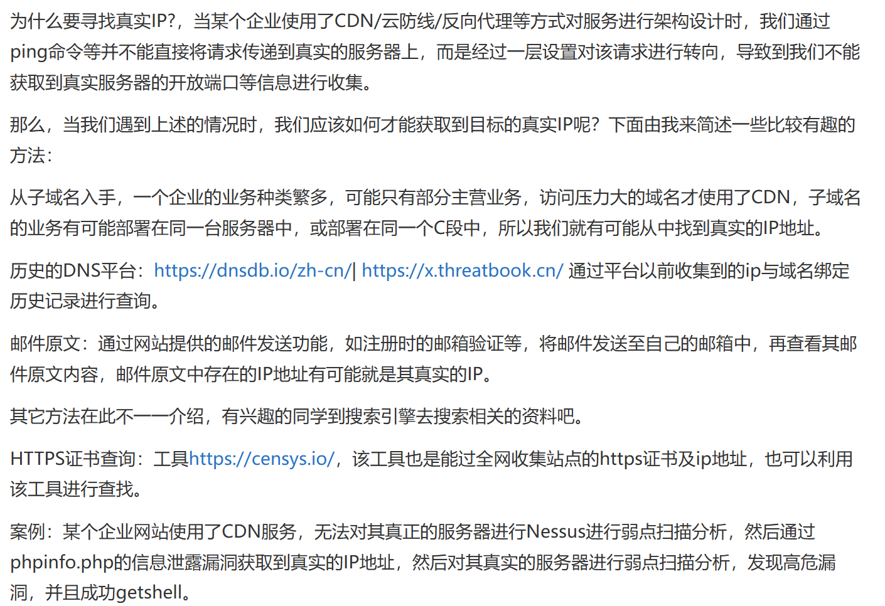

## 搜索引擎语法
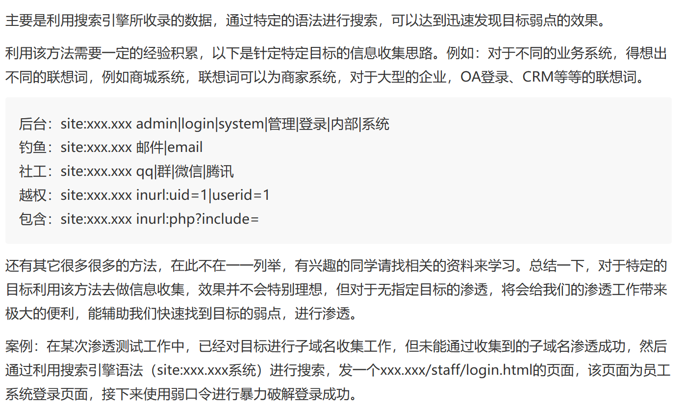

## 爬虫分析
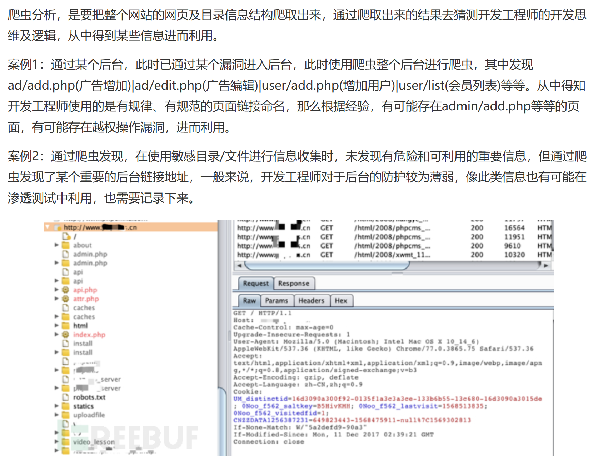

## AWVS web弱点扫描
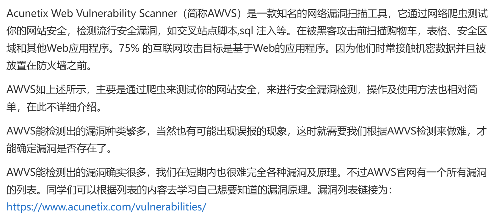

## Nessus主机弱点扫描
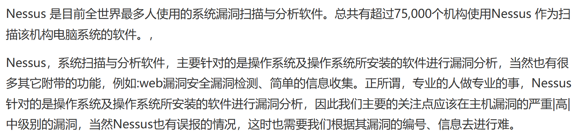

## whois信息收集、员工信息、公司名、社工库、云盘搜索
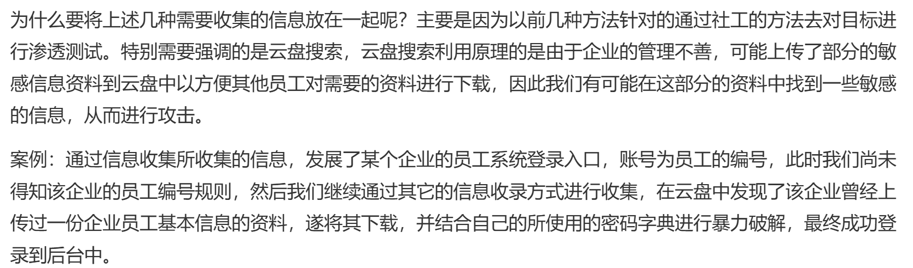