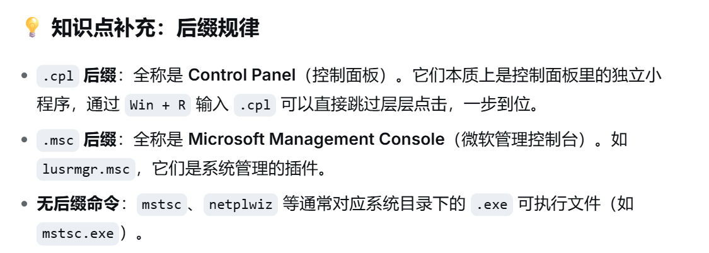

系统与核心管理
# cmd(Command Prompt) :命令提示符
# `taskmgr`(Task Manager) :任务管理器(管理进程、结束卡死的软件)
# `services.msc` :系统服务管理(排查网络服务、启动关闭服务)
# `regedit`(Registry Editor) :注册表编辑器(慎重修改,改坏了容易崩系统)
# `msconfig`(System Configuration) :系统配置(管理开机启动项)
# `compmgmt`(Computer Management).msc :计算机管理(包含设备管理、磁盘管理等综合面板)
# `diskmgmt`(Disk Management).msc :磁盘管理(分区、格式化)
# `devmgmt`(Device Manager).msc :设备管理器(查看网卡、驱动是否正常)
# `eventvwr`(Event Viewer).msc :事件查看器(看系统报错、蓝屏、安全日志)
# `secpol.msc`(Security Policy) :本地安全策略(想改密码规则、查提权漏洞)
# `gpedit.msc`(Group Policy Edit) :组策略编辑器(想改系统外观或限制软件)
## gpedit.msc(大总管)包含了 secpol.msc(保安队长)
## .msc(Microsoft Management Console) :微软管理控制台
## .cpl(Control Panel) :控制面板

网络与抓包
# `ncpa.cpl`(Network Connection Control Panel Applet/Network Connections) :网络连接(查看网卡、配置虚拟机网卡、静态IP)
# `inetcpl.cpl`(Internet Control Panel/Internet Properties) :Internet属性(配置系统代理,抓包是经常修改这里)
# `firewall.cpl` :Windows防火墙设置
# `mstsc`(Miscrosoft Terminal Services Client) :远程桌面连接(可以连接虚拟机)
# `sysdm.cpl(System Device Manager/System Properties) :系统属性(配置环境变量的入口,写代码/配Python经常用)
# `control userpassword2` 或 `netplwiz`(Network Places Wizard) :用户账户管理
# `lusrmgr.msc`(Local Users Manager) :本地用户和组(添加用户、修改密码)

文件夹与路径
# `%temp%` :系统临时文件夹(垃圾文件最多的地方)
# `%appdata%`:程序配置数据目录(常用于找软件的配置文件)
# `%loccalappdata%` :本地程序数据(很多软件的缓存、抓包工具的临时数据)
# `%userprofile%\Desktop` :直达桌面
# `shell:startup` :开机启动文件夹(放快捷方式进去,电脑开机就会自动运行,渗透测试维持权限常用)
# `C:\`、`D:\` :直接打开对应盘符

系统工具与信息查看
# `ms-settings:`(Microsoft Settings) :设置
# `winver`(Windows Version) :查看当前Windows版本号
# `dxdiag` :DirectX诊断工具(看显卡、声卡、系统硬件信息)
# `cleanmgr`(Clean Manager) :磁盘清理
# `resmon`(Resource Monitor) :资源监视器(比任务管理器更详细,能看网络占用和端口)

# 管理员身份运行 :Ctrl+Shift+回车
