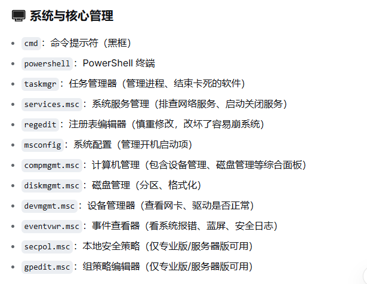
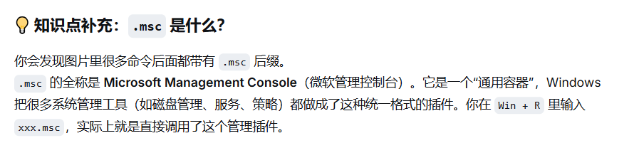
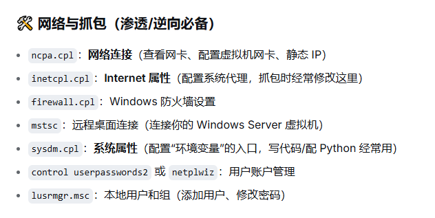
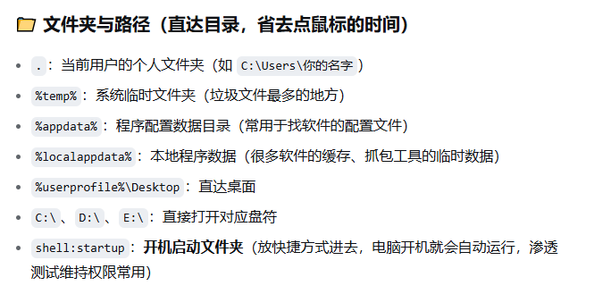
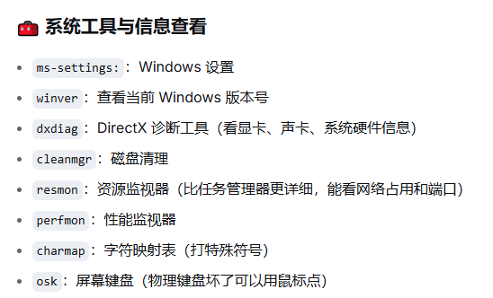
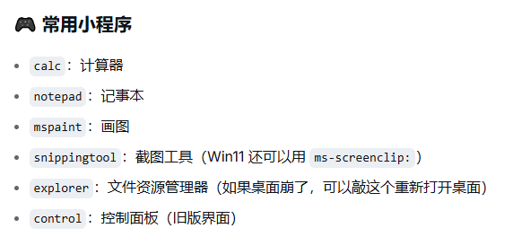

# cmd(Command Prompt) :命令提示符
# taskmgr(Task Manager) :任务管理器(管理进程、结束卡死的软件)
# services.msc :系统服务管理(排查网络服务、启动关闭服务)
# regedit(Registry Editor) :注册表编辑器(慎重修改,改坏了容易崩系统)
# msconfig(System Configuration) :系统配置(管理开机启动项)
# compmgmt(Computer Management).msc :计算机管理(包含设备管理、磁盘管理等综合面板)
# diskmgmt(Disk Management).msc :磁盘管理(分区、格式化)
# devmgmt(Device Manager).msc :设备管理器(查看网卡、驱动是否正常)
# eventvwr(Event Viewer).msc :事件查看器(看系统报错、蓝屏、安全日志)
# secpol.msc(Security Policy) :本地安全策略(想改密码规则、查提权漏洞)
# gpedit.msc(Group Policy Edit) :组策略编辑器(想改系统外观或限制软件)
## gpedit.msc(大总管)包含了 secpol.msc(保安队长)
## .msc

# ncpa.cpl(Network Connections) :网络连接(查看网卡、配置虚拟机网卡、静态IP)
# inetcpl.cpl :Internet属性(配置系统代理,抓包是经常修改这里)
# firewall.cpl :Windows防火墙设置
# mstsc :远程桌面连接(可以连接虚拟机)
# sysdm.cpl :系统属性(配置环境变量的入口,写代码/配Python经常用)
# control userpassword2 或 netplwiz :用户账户管理
# lusrmgr.msc :本地用户和组(添加用户、修改密码)

# 管理员身份运行 :Ctrl+Shift+回车
