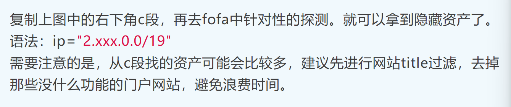

# 信息收集

# 1、备案资产
## 工信部(https://beian.miit.gov.cn/#/home)
## 推荐工具:ICP_Query
## 资产测绘平台：fofa、hunter

# 2、寻找隐藏资产
## 小蓝本(https://sou.xiaolanben.com/pc)
### 针对网站，主要是找未备案的资产，即是不是以域名存在的资产，简单的来说就是没域名，通过ip访问的资产
## 查询网(https://www.ip138.com/)
### 查对应的c段地址，再将c段地址放到fofa探测得到隐藏资产，语法：ip="c段"
